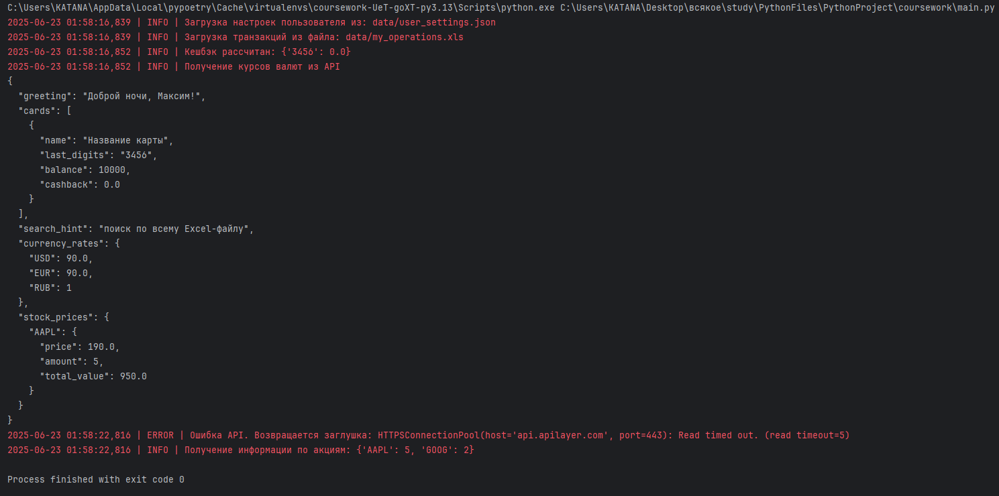
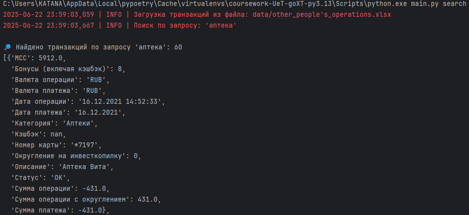
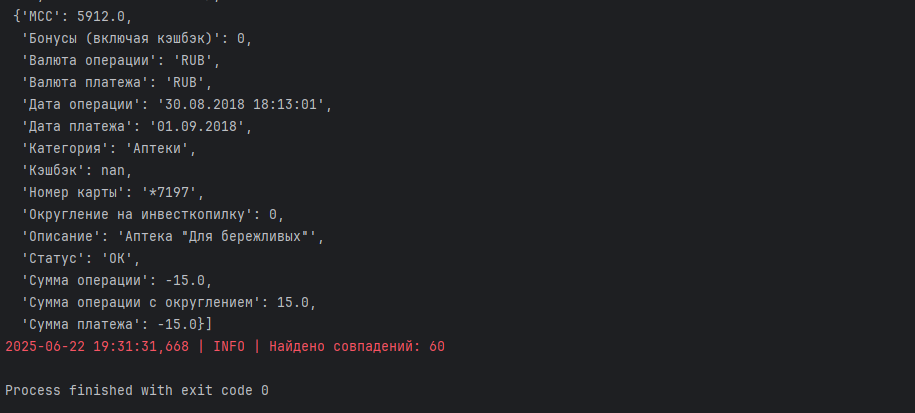
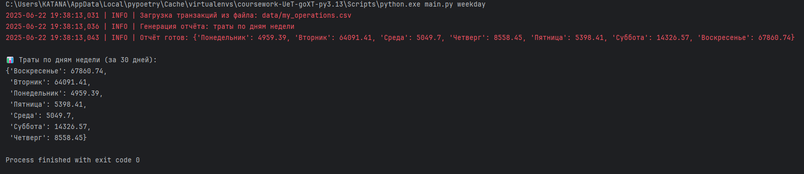
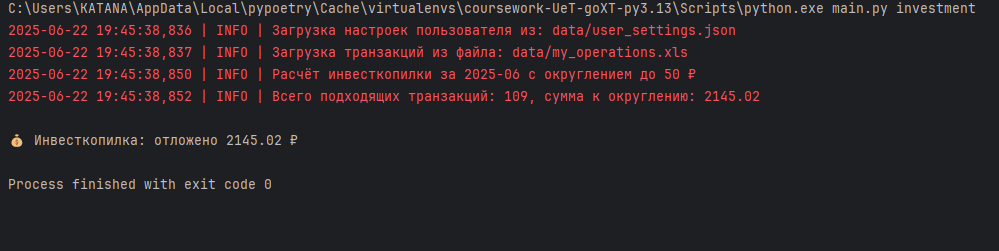

# Первая курсовая: Финансовый помощник

## 📄 Описание

Приложение для анализа личных финансов, построенное на Python. Обрабатывает Excel-файл с транзакциями и формирует отчёты, рекомендации и API-ответы с курсов валют и инвестиционной информацией.

## 🚀 Запуск

1. Установить зависимости:
```bash
poetry install
```

2. Создать файл `.env` с API-ключом:
```
EXCHANGE_API_KEY=your_api_key
```

3. Запустить основной модуль:
```bash
python main.py
```

## ⚙️ Режимы запуска (main.py)

| Команда                     | Что делает                                                                      |
|-----------------------------|---------------------------------------------------------------------------------|
| `python main.py`            | запуск страницы «Главная»                                                       |
| `python main.py search`     | поиск по транзакциям (simple_search)                                            |
| `python main.py weekday`    | отчёт «Траты по дням недели» за 30 дней                                         |
| `python main.py investment` | инвесткопилка округляет каждую трату до ближайшего лимита (например, до 100 ₽). |


## 🧪 Тесты

```bash
pytest --cov
coverage html
```

## 🌐 Используемое API

- [https://apilayer.com/marketplace/exchangerates_data-api](https://apilayer.com/marketplace/exchangerates_data-api)

## 📸 Скриншот результата

- пример запуска python main.py  



- пример запуска python main.py search  




- пример запуска python main.py weekday



- пример запуска python main.py investment




## 📁 Структура проекта

- `src/` — бизнес-логика
- `tests/` — тесты с параметризацией, фикстурами, mock
- `data/` — входные данные (`user_settings.json`, `operations.xls`)

## 🧰 Универсальный шаблон user_settings.json

```json
{
  "user": "Имя",
  "cards": [
    {
      "name": "Название карты",
      "number": "0000111122223456",
      "cashback_categories": ["Ваша категория", "Ваша категория"],
      "balance": 10000
    }
  ],
  "portfolio": {
    "AAPL": 5,
    "GOOG": 2
  },
  "user_currencies": ["USD", "EUR"],
  "user_stocks": ["AAPL", "GOOG"]
  "rounding_limit": 50,
  "investment_month": "YYYY-MM"
}
```
## 💰 Инвесткопилка

Функция `investment_bank` рассчитывает, сколько можно отложить на инвестиции за выбранный месяц, округляя каждую трату до ближайшего лимита (например, до 100 ₽).

### 🔧 Настройки

Все параметры настраиваются через файл [`data/user_settings.json`](data/user_settings.json):

```json
{
  "investment_month": "2025-06",
  "rounding_limit": 100
}
```

- `investment_month` — месяц в формате `ГГГГ-ММ` (например, `"2025-06"`).
- `rounding_limit` — до какой суммы округлять каждую покупку (по умолчанию 100).

### ▶️ Как запустить

Чтобы рассчитать сумму инвесткопилки:

```bash
python main.py investment
```

Вывод будет таким:

```
2025-06-22 17:37:42 | INFO | Расчёт инвесткопилки за 2025-06 с округлением до 100 ₽
💰 Инвесткопилка: отложено 3450.0 ₽
```